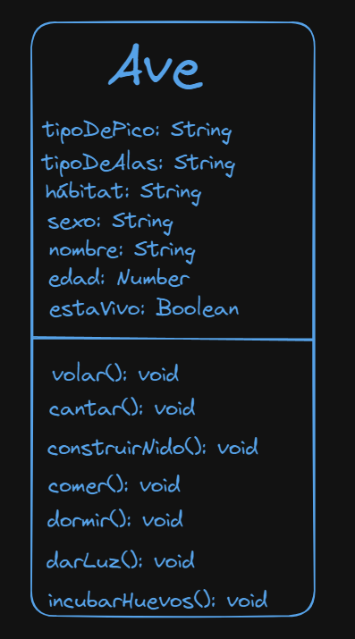

# Taller de Orientacion a Objetos

- 1. [Objetivos](#Objetivos)
- 2. [Introducción](#Introducción)
- 3. [Procedimiento Teorico](#Procedimiento Teorico)
- 4. [Procedimiento Practico](#Procedimiento Practico)

## Objetivos

- Introduccion: Comprendiendo que es un paradigma
- ¿Qué es el paradigma orientado a objetos?
- ¿Que es un Objeto?
- Atributos y metodos de un objeto
- Los 4 pilares del paradigma orientado a objetos
- Ejercicio teorico-practico

## Introduccion

La Programación Orientada a Objetos (POO) es un paradigma de programación que utiliza "objetos" y sus interacciones para diseñar aplicaciones y programas informáticos. Es un enfoque flexible y potente que se puede implementar en diversos lenguajes de programación como Java, C++, Python, Ruby, y muchos otros. A través de la POO, se facilita la gestión de programas más complejos, permitiendo al desarrollador dividir el código en unidades manejables, reutilizables y organizadas.

Y... Que es un paradigma? Un paradigma es una teoría o modelo explicativo de las realidades físicas. Con el significado de paradigma científico, se usa hoy en la investigación científica y fue introducido por Thomas Kuhn (1975) para explicar o los cambios o “revoluciones científicas”. El lenguaje, por ejemplo, puede ser entendido como un paradigma al ser un sistema de símbolos y reglas que es usado para la comunicación y el pensamiento. De la misma manera, los paradigmas en la programación nos ayudan a comprender y manejar la complejidad de los sistemas informáticos al ofrecer marcos de trabajo específicos dentro de los cuales los programas son desarrollados.

En términos de programación, un paradigma no solo define el estilo de programación, sino que influye en cómo se piensa y se resuelve un problema mediante el código. Algunos de los paradigmas más conocidos incluyen la programación imperativa, funcional, lógica y orientada a objetos, cada uno con sus propias metodologías y herramientas preferidas para abordar tareas específicas y resolver problemas de manera eficiente.

Por ejemplo, mientras que la programación imperativa se centra en describir paso a paso cómo debe ejecutarse un programa, la programación funcional trata sobre la construcción de programas como la evaluación de funciones matemáticas y evita estados y datos mutables. Por su parte, la programación orientada a objetos utiliza objetos y clases para encapsular datos y comportamientos, facilitando así la reutilización y la modularidad.

### Introducción a Conceptos Básicos

#### ¿Qué es un Objeto?

Un objeto es una instancia de una clase que contiene un estado y un comportamiento relacionados con ese estado. El estado se representa mediante atributos y el comportamiento mediante métodos.

#### Atributos y Métodos de un Objeto

Atributos: Características del objeto, como color, tamaño, forma, etc. Estos son datos que el objeto "conoce" sobre sí mismo.

Métodos: Funciones o procedimientos que el objeto puede realizar, como calcular, moverse, mostrar información, etc. Estos definen las acciones que el objeto puede ejecutar.

### Los Cuatro Pilares de la POO

- Encapsulamiento: Protege el estado de un objeto de cambios no autorizados al ocultar sus atributos, haciendo que solo se puedan modificar mediante métodos específicos.

- Abstracción: Simplifica la complejidad al esconder los detalles complicados y mostrar solo los aspectos esenciales del objeto.

- Herencia: Permite la creación de nuevas clases basadas en clases existentes. La nueva clase hereda los atributos y métodos de la clase base, permitiendo la reutilización y la extensión de código.

- Polimorfismo: Proporciona la capacidad de presentar el mismo método en diferentes formas. Por ejemplo, un método dibujar() podría ser implementado de manera diferente para circulo, cuadrado o triangulo.

En este taller, abordaremos Abstracción, Herencia y Polimorfismo.

## Procedimiento Teorico

### Familiarizandonos con diagramas de clase

- Visitar el siguiente link [Ejemplo clases](https://link.excalidraw.com/l/7017w2AeI6S/7voKzrjowHX)
- Pones tu nombre como invitado, por ejemplo, "Daniel Daza".
- Identifica las clases fuertes y las clases debiles. Tip: Las clases fuertes son las clases de las cuales, las clases debiles dependen o heredan.
- ¿Encuentras alguna redundancia en los atributos y metodos de las clases fuertes con respecto a las clases debiles?

### Creación de las Entidades

- A continuacion, crea 4 entidades más:

  - Ave: Crea una nueva clase llamada Ave que represente las aves en general. Las aves son animales ovíparos, por lo que pueden dar a luz a sus crías o incubar huevos.

    - Atributos: tipoDePico, tipoDeAlas, hábitat, sexo, nombre, edad, estaVivo.
    - Métodos: volar, cantar, construirNido, comer, dormir, darLuz, incubarHuevos

  - Felino: Crea una nueva clase llamada Felino que represente los felinos en general. Los felinos son animales carnívoros y cazadores, por lo que tienen garras afiladas y son excelentes trepadores.

    - Atributos: tipoDePelaje, hábitat, tipoDeGarras, sexo, nombre, edad, estaVivo, placenta
    - Métodos: cazar, trepar, ronronear, comer, dormir, darLuz, amamantar.

  - Pez: Crea una nueva clase llamada Pez que represente los peces en general. Los peces son animales ovíparos, por lo que pueden dar a luz a sus crías o incubar huevos.

    - Atributos: tipoAletas, tipoEscamas, hábitat, sexo, nombre, edad, estaVivo, tipoHuevo
    - Métodos: nadar, respirar, comer, dormir, darLuz, incubarHuevos

  - Paquidermo: Crea una nueva clase llamada Paquidermo que represente los paquidermos en general. Los paquidermos son animales mamiferos viviparos, por lo que dan a luz a sus crías vivas.
    - Atributos: tipoDePiel, tipoDePatas, hábitat, sexo, nombre, edad, estaVivo, placenta
    - Métodos: nadar, comer, dormir, darLuz, amamantar.

### Diagrama de clases

- Realiza un diagrama de clases que represente las 4 entidades creadas.

  - Pero Team Lead, y como creamos el diagrama de clases?

    - Puedes utilizar herramientas de dibujo como Excalidraw, draw.io o cualquier otra que te permita diagramar figuras basicas.
    - Para este taller, utilizaremos Excalidraw, puedes hacer clic en el siguiente enlace [Ejemplo clases](https://excalidraw.com) y poner tu nombre como invitado, por ejemplo, "Daniel Daza".
    - Dibuja un cuadro grande que represente el objeto, por ejemplo, Ave, y dentro del cuadro escribe los atributos y métodos de la clase.

      - Pero Team Lead, y que son atributos y metodos? Recordemos la seccion: [Atributos y Métodos de un Objeto](#atributos-y-métodos-de-un-objeto), pero igualmente, demos un recorderis:
        - Los atributos son las características del objeto, como color, tamaño, forma, etc. Estos son datos que el objeto "conoce" sobre sí mismo.
        - Los métodos son funciones o procedimientos que el objeto puede realizar, como calcular, moverse, mostrar información, etc. Estos definen las acciones que el objeto puede ejecutar.
      - Ahora que ya sabes que son atributos y metodos, puedes dibujar un cuadro grande que represente el objeto, por ejemplo, Ave, y dentro del cuadro escribe los atributos y métodos de la clase.
        - Pero Team Lead, y como diferencio la sintaxis de atributos y la sintaxis metodos?
          - Los atributos los vamos a crear justo despues del nombre del objeto, por ejemplo, Ave, debajo definimos los atributos tipoDePico..., seguido de dos puntos y el tipo de dato, por ejemplo, String, Number, Boolean, etc.
          - Los métodos los vamos a crear justo despues de los atributos, separados por una linea y con paréntesis al final, por ejemplo, volar(), cantar(), construirNido(), comer(), dormir(), darLuz(), incubarHuevos(), seguido de dos puntos y el tipo de dato que retorna, por ejemplo, void, String, Number, Boolean, etc. En este caso, por propositos educativos, vamos a usar void, que significa que no retorna nada.
      - Veamos el resultado esperado con ave:

          

      - Ahora, puedes hacer lo mismo con las clases Felino, Pez y Paquidermo.

### Manejo de la redundancia

- Como puedes observar, existen varios atributos y métodos que se repiten en nuestro código: los atributos son 'género', 'edad', 'nombre', y 'estáVivo', mientras que los métodos comunes son 'comer()', 'dormir()', y 'darLuz()'. En programación, es fundamental adherirse al principio DRY (Don't Repeat Yourself), que aboga por minimizar la duplicación. Este principio nos guía hacia el diseño de sistemas más eficientes y menos propensos a errores, al evitar la redundancia de código.

- Una vez completado el diagrama de clases, toma una captura de pantalla y adjunta esa imagen al finalizar el taller. Esto servirá como evidencia de tu trabajo y comprensión del paradigma orientado a objetos. Tomale una captura de pantalla y adjunta a este taller el resultado final.

### Polimorfismo

- Puede que te preguntes, ¿dónde quedan el proceso de abstracción y herencia? Bien, recordemos que la abstracción consiste en centrarnos en los aspectos más relevantes para el negocio. Si ciertas propiedades o métodos que una entidad posee en la naturaleza no son necesarios para las necesidades específicas del negocio, entonces simplemente no se incluyen. Esto permite diseñar sistemas más limpios y eficientes, alineados exclusivamente con los requisitos funcionales y operativos del negocio.

- Cuando mencionamos redundancia anteriormente, estábamos abordando, de manera implícita, la herencia. La herencia en la programación orientada a objetos tiene el propósito de minimizar la repetición en la definición de propiedades y métodos a lo largo de diversas entidades, facilitando así la reutilización de código. Sin embargo, es crucial considerar las particularidades de cada clase al implementar métodos heredados. Tomemos, por ejemplo, el método darLuz() para animales vivíparos. Aunque este método puede ser común entre ellos, el tiempo de gestación varía significativamente, como los 110 días de gestación de un felino como el león comparado con los 22 meses de un paquidermo como el elefante.

- Dada esta comprensión de la herencia, donde adaptamos métodos comunes para atender a las particularidades de cada subclase, nos encontramos perfectamente posicionados para explorar el concepto de polimorfismo. Este principio nos permite que un mismo método se manifieste de diferentes maneras en distintas clases, aprovechando la estructura de herencia para especializar su comportamiento de acuerdo con las necesidades específicas de cada entidad. Veamos la diferencia de ambos metodos

```javascript
let tiempoGestacionLeon = 2.891e10; // Equivalente a 11 meses
let tiempoGestacionElefante = 5.782e10; // Equivalente a 22 meses

// Metodo darLuz León
function darLuz() {
  setTimeout(() => console.log("Nace un leon"), tiempoGestacionLeon);
}

// metodo darLuz Elefante
const darLuz = () => {
  setTimeout(function () {
    console.log("Nace un elefante");
  }, tiempoGestacionElefante);
};
```

Como puedes observar, aunque ambos métodos tienen el mismo nombre y cumplen funciones similares en términos generales, difieren en cómo se implementan

## Procedimiento Practico

En esta sección, diseñaran dos sistemas usando los tres principios de la Programación Orientada a Objetos (POO): una tienda de puntos online y un servicio de entrega de comida. A continuación, se describen las entidades básicas para cada sistema, que deberán ser desarrolladas y organizadas aplicando herencia, abstracción y polimorfismo.

- Sistema 1: Tienda de Puntos Online
    - Descripción: Una plataforma online donde los usuarios acumulan puntos a través de diversas actividades y los canjean por productos o servicios.

    - Entidades Sugeridas:
    
        - Usuario:
            - Atributos: nombre, email, puntosAcumulados, clave
            - Métodos: acumularPuntos(), canjearPuntos()
        
        - ProductoFisico:
            - Atributos: nombre, puntosNecesarios, cantidadDisponible, precio, stock
            - Métodos: actualizarStock(), obtenerInfo(), enviarProducto()

        - ProductoDigital:
            - Atributos: nombre, puntosNecesarios, URL, cantidadDisponible, stock
            - Métodos: obtenerInfo(), descargar(), obtenerProductoEmail()

        - Actividad:
            - Atributos: tipo, puntosOtorgados
            - Métodos: completarActividad()

        - Categoría de Producto
            - Atributos: nombre, descripción
            - Métodos: listarProductos()

        - Orden de Canje
            - Atributos: usuario, producto, fecha
            - Métodos: confirmarOrden(), cancelarOrden()

        - Administrador
            - Atributos: nombre, email, clave
            - Métodos: agregarProducto(), modificarProducto(), eliminarUsuario()

- Sistema 2: Servicio de Entrega de Comida
    - Descripción: Un sistema para ordenar comida desde múltiples restaurantes locales con opción de entrega a domicilio o recogida en el local.

    - Entidades sugeridas:
        - Cliente:
            - Atributos: nombre, email, clave, dirección, teléfono
            - Métodos: realizarPedido(), verHistorialPedidos(), autenticacion()
        
        - RestauranteDigital:
            - Atributos: nombre, menuQR
            - Métodos: agregarPlato(), actualizarPlato()

        - RestauranteFisico:
            - Atributos: nombre, dirección, menuFisico
            - Métodos: agregarPlato(), actualizarPlato(), eliminarPlato()

        - Pedido:
            - Atributos: cliente, restaurante, detallesPedido, estadoPedido
            - Métodos: actualizarEstado(), calcularTotal()

        - Plato
            - Atributos: nombre, precio, ingredientes
            - Métodos: obtenerInfo()

        - MenuQR
            - Atributos: plato, URL.
            - Métodos: generarQR()

        - MenuFisico
            - Atributos: plato
            - Métodos: impresion(), visualizacion()

        - Repartidor
            - Atributos: nombre, email, clave, vehículo, disponibilidad
            - Métodos: aceptarEnvío(), actualizarUbicación(), completarEntrega(), autenticacion(), actualizarEstado()

- Tareas Comunes para Ambos Sistemas
    - Diagramar Clases: Utilizar herramientas como Excalidraw o draw.io para crear diagramas de clases que reflejen la estructura de ambos sistemas, incluyendo relaciones de herencia, atributos y metodos. Asegúrate de que los diagramas de clases reflejen claramente la herencia y las asociaciones entre clases.
    - Aplicar Principios POO:
        - Revisa cada clase y método para asegurarte de que cumplen su propósito sin exponer demasiados detalles innecesarios (abstracción).
        - Aprovecha la herencia para evitar la duplicación de código.
        - Implementa polimorfismo donde sea práctico para permitir que métodos con el mismo nombre realicen acciones distintas basadas en la clase que los invoca. Por ejemplo, el metodo actualizarEstado de disponible a no disponible del repartidor, tiene una diferente implementacion del mismo metodo pero en Pedido, el cual actualizaria el estado del pedido.
    - Comprimir todo en un archivo con el formato primerNombre-primerApellido-Ultimos3DigitosCedula.zip y subirlo a la plataforma en la semana 3 del modulo de Javascript.


